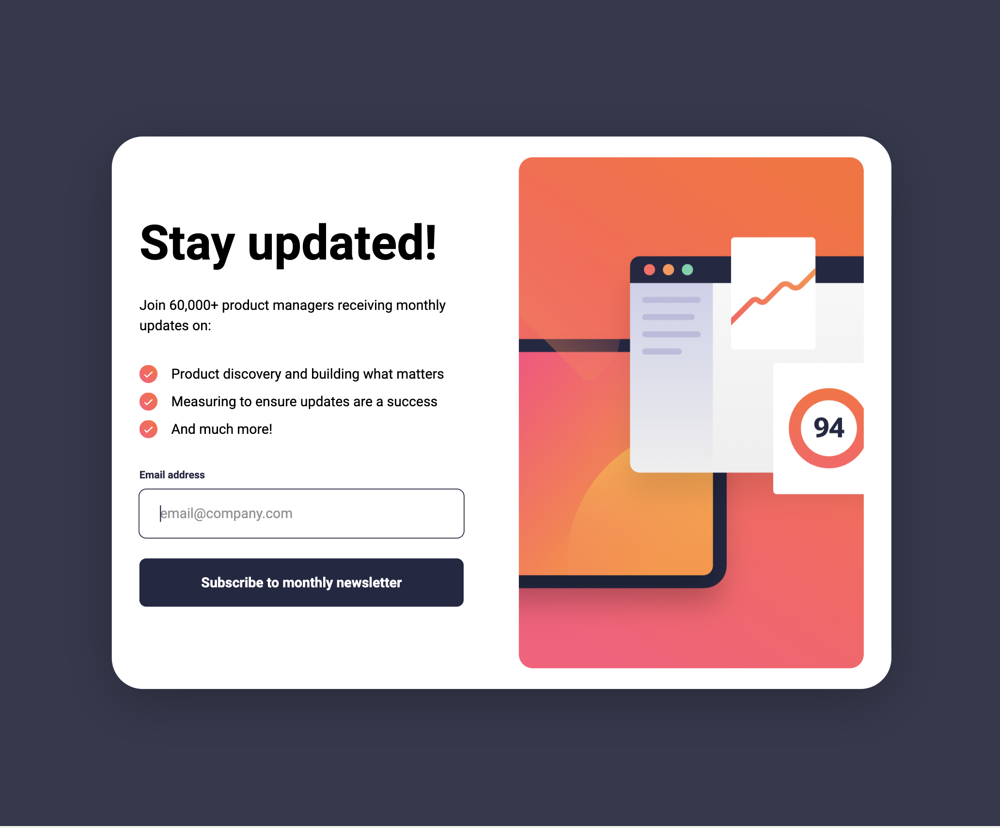
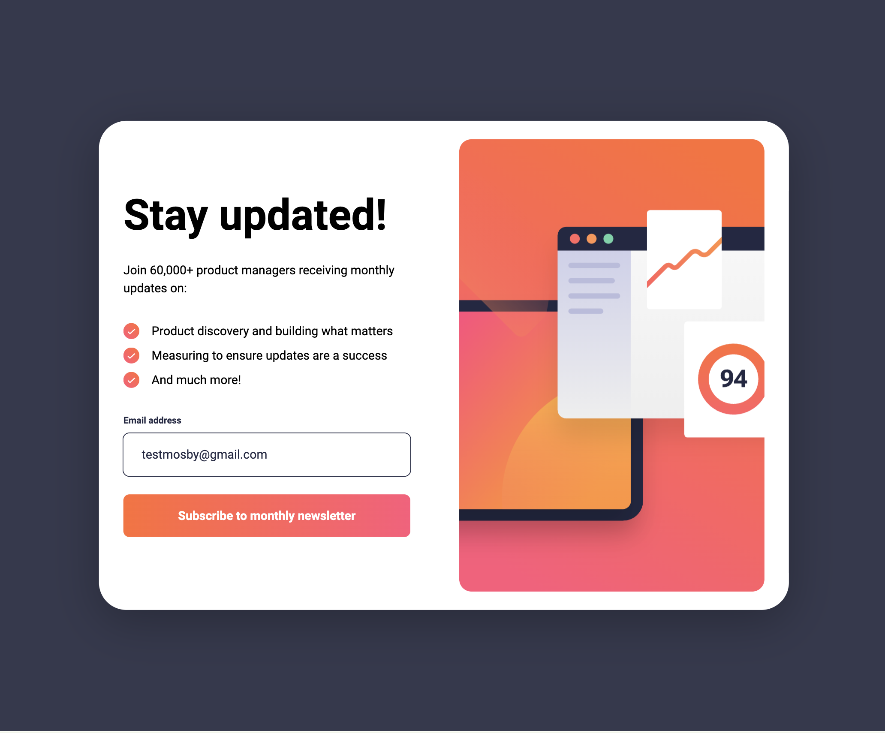

# Frontend Mentor - Newsletter sign-up form with success message solution

This is a solution to the [Newsletter sign-up form with success message challenge on Frontend Mentor](https://www.frontendmentor.io/challenges/newsletter-sign-up-form-with-success-message-3FC1AZbNrv). Frontend Mentor challenges help you improve your coding skills by building realistic projects. 

## Table of contents

- [Overview](#overview)
  - [The challenge](#the-challenge)
  - [Screenshots](#screenshots)
  - [Links](#links)
- [My process](#my-process)
  - [Built with](#built-with)
  - [What I learned](#what-i-learned)
  - [Continued development](#continued-development)
  - [Useful resources](#useful-resources)
- [Author](#author)

---

## Overview

### The challenge

Users should be able to:

- Add their email and submit the form
- See a success message with their email after successfully submitting the form
- See form validation messages if:
  - The field is left empty
  - The email address is not formatted correctly
- View the optimal layout for the interface depending on their device's screen size
- See hover and focus states for all interactive elements on the page

---

### Screenshots

#### Start Screen

#### Error State

#### Active State

---

### Links

- [Solution URL](https://github.com/martinianol/newsletter-sign-up-form)
- [Live Site URL](https://martinianol.github.io/newsletter-sign-up-form/)

---

## My process

### Built with

- Semantic HTML5 markup
- CSS custom properties
- Flexbox
- CSS Grid
- Mobile-first workflow
- [React](https://reactjs.org/) - JS library
- [Vite](https://vitejs.dev/) - Frontend tooling
- [Styled Components](https://styled-components.com/) - For styles

---

### What I learned

Working on this project helped me understand how to handle:

- Deployment of Vite apps to GitHub Pages using `import.meta.env.BASE_URL`.
- Dynamically applying background images in styled-components with imports.
- Handling focus states and keyboard accessibility with React hooks.
- Validating user input and providing instant feedback using styled-components and React state management.

---

### Continued development

Moving forward, I want to:

- Improve animations and transitions to enhance user experience.
- Implement a more robust form validation system with libraries like `yup` or `react-hook-form`.
- Explore using TypeScript for better type safety and improved developer experience.

---

### Useful resources

- [Vite Documentation](https://vitejs.dev/guide/)
- [Styled-Components Documentation](https://styled-components.com/docs)
- [Regex Cheat Sheet](https://cheatography.com/davechild/cheat-sheets/regular-expressions/)

---

## Author

- Frontend Mentor - [@martinianol](https://www.frontendmentor.io/profile/martinianol)
- GitHub - [martinianol](https://github.com/martinianol)

---
